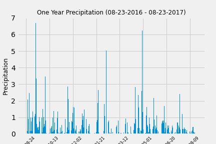
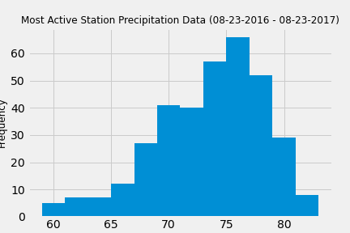

# sqlalchemy-weather

Climate analysis using SQLAlchemy to query a [database](Resources/hawaii.sqlite) containing temperature observations in Hawaii using ORM queries, Pandas, and Matplotlib.

# Exploratory precipitation analysis

Climate analysis and data exploration on the database. This script finds the most recent date recorded and queries all precipitation data for the last year. The results are plotted on a bar chart to determine which time periods have the highest amount of precipitation. 

## Station Analysis

This script queries the database to find the station with the highest number of recordings and retrieves that last year of temperature observation data for that station. The results are plotted on a histogram to determine the frequency of precipitation data. 

- - -

# Climate App

Flask app that uses SQLAlchemy to query the database and return jsonified results for the following data: 
* Precipitation date and amount
* A list of stations 
* Precipitation data for the most recent year in the database
* The minimum, maximum, and average precipitation for the start and (optional) end dates. 

## Tools used
Python, SQL Alchemy, Pandas, Matplotlib, Flask, Jsonify, Datetime